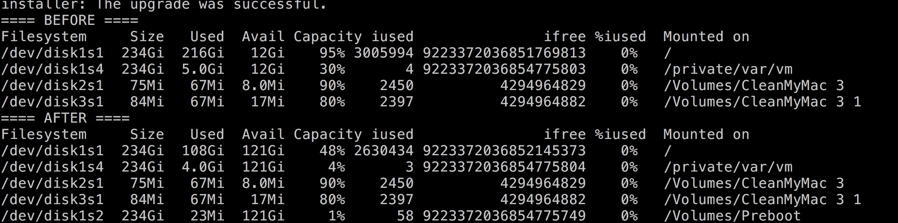

# CleanYourMac
Run a script to clean your mac

ℹ️Will remove Xcode downloaded Simulator and symbol of iOS Device.

ℹ️Some dir or file can not remove under root!

#### 1. Usage:

```shell
$sh CleanYourMac.sh
```

Part of log:
